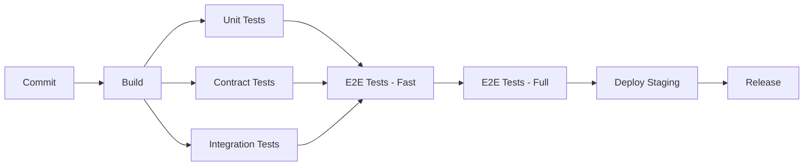

# E2E and CI Pipeline Testing Strategy

## Executive Summary

This document outlines a comprehensive strategy for extending O3K's test coverage beyond contract tests to include end-to-end (E2E) testing and continuous integration (CI) pipeline automation. Current status: 82% contract test coverage (157/191 passing), ready for E2E scenarios and CI integration.

---

## 1. Current Testing Landscape

### 1.1 Existing Test Infrastructure

| Test Type | Coverage | Tool/Framework | Status |
|-----------|----------|----------------|--------|
| **Contract Tests** | 157/191 (82%) | gophercloud SDK | ✅ Operational |
| **Integration Tests** | 20+ scripts | Bash + OpenStack CLI | ✅ Operational |
| **Unit Tests** | Per-file | Go testing stdlib | ✅ Operational |
| **E2E Tests** | 0 | None | ⏳ **Needs Implementation** |
| **CI Pipeline** | 0 | None | ⏳ **Needs Implementation** |

### 1.2 Gap Analysis

**Contract Tests** validate API contracts but don't cover:
- Multi-service workflows (e.g., VM with volume + network)
- Real-world user scenarios (Terraform apply, Horizon workflows)
- Performance under load
- Upgrade/migration paths
- Multi-node deployments

**Integration Tests** exist but are:
- Manual execution only (no automation)
- No CI/CD integration
- No failure reporting/tracking
- Limited to basic workflows

---

## 2. E2E Testing Strategy

### 2.1 Objectives

1. **Validate real-world workflows** - Test scenarios users actually perform
2. **Multi-service integration** - Verify cross-service interactions
3. **Client compatibility** - Validate Terraform, Horizon, CLI simultaneously
4. **Performance baselines** - Establish acceptable response times
5. **Regression detection** - Catch breaking changes before release

### 2.2 E2E Test Scenarios

#### Priority 1: Core Workflows (Must Have)

| Scenario | Services | Validation |
|----------|----------|------------|
| **VM Full Lifecycle** | Nova + Neutron + Cinder + Glance | Create VM with volume + network → verify connectivity → snapshot → delete |
| **Terraform Stack Deploy** | All services | Apply Terraform with `openstack_*` resources → verify state → destroy |
| **Horizon Dashboard Workflow** | Keystone + Nova | Login → create server → attach volume → assign floating IP → delete |
| **Volume Attach/Detach** | Nova + Cinder | Create VM → attach volume → write data → detach → attach to new VM → verify data |
| **Network Isolation** | Neutron + Nova | Create 2 networks → launch VMs on each → verify isolation → add router → verify connectivity |

#### Priority 2: Advanced Features (Should Have)

| Scenario | Services | Validation |
|----------|----------|------------|
| **Multi-Tenant Isolation** | Keystone + all | Create 2 projects → deploy resources → verify isolation |
| **Security Groups** | Neutron + Nova | Create VM → apply security group → verify blocked/allowed traffic |
| **Floating IP Assignment** | Neutron + Nova | Create VM on private network → assign floating IP → verify external access |
| **Snapshot and Restore** | Nova + Glance + Cinder | Create VM → take snapshot → restore to new VM → verify identical |
| **Image Upload via Horizon** | Glance + Horizon | Upload image through UI → verify metadata → launch VM from image |

#### Priority 3: Operational Scenarios (Nice to Have)

| Scenario | Services | Validation |
|----------|----------|------------|
| **High Availability** | All | Kill O3K process → restart → verify state consistency |
| **Database Migration** | Database + all | Apply new migration → verify no data loss → rollback → verify |
| **Multi-Node VXLAN** | Neutron + Nova + Compute nodes | Deploy VMs on 2 nodes → verify cross-node connectivity |
| **Performance Under Load** | All | 100 concurrent API requests → measure response times → verify no degradation |

### 2.3 E2E Test Implementation

#### Option A: Extend Bash Integration Tests ✅ **Recommended**

**Approach**: Enhance existing `test/` scripts with E2E scenarios.

**Pros**:
- Builds on existing infrastructure
- Uses OpenStack CLI (real client validation)
- Easy to read and maintain
- Fast iteration

**Cons**:
- Limited parallelization
- No structured reporting
- Bash limitations for complex logic

**Implementation**:
```bash
test/
├── e2e/
│   ├── vm_full_lifecycle.sh          # VM + volume + network
│   ├── terraform_stack_deploy.sh      # Terraform apply/destroy
│   ├── horizon_workflow.sh            # Selenium-based UI test
│   ├── volume_attach_detach.sh        # Volume operations
│   └── network_isolation.sh           # Multi-network test
└── lib/
    ├── common.sh                      # Shared functions
    ├── wait.sh                        # Wait-for-condition helpers
    └── report.sh                      # JSON test reporting
```

#### Option B: Go-Based E2E Framework

**Approach**: Create `test/e2e/` with Go test framework using gophercloud.

**Pros**:
- Type-safe, structured tests
- Better error handling
- Parallel execution
- Integrated with Go tooling

**Cons**:
- More setup overhead
- Duplicates bash test patterns
- Requires gophercloud knowledge

**Implementation**:
```
test/e2e/
├── framework/
│   ├── setup.go          # Test environment setup
│   ├── clients.go        # gophercloud client init
│   └── wait.go           # Wait conditions
├── scenarios/
│   ├── vm_lifecycle_test.go
│   ├── terraform_test.go
│   └── network_isolation_test.go
└── suite_test.go         # Test suite runner
```

#### Option C: Hybrid Approach ⚡ **Best of Both Worlds**

**Approach**: Bash for simple workflows, Go for complex scenarios.

**Pros**:
- Flexibility to choose right tool
- Gradual migration path
- Reuse existing bash scripts

**Cons**:
- Two test systems to maintain
- Need coordination between both

### 2.4 E2E Test Execution

**Development**:
```bash
# Run all E2E tests
make test-e2e

# Run specific scenario
./test/e2e/vm_full_lifecycle.sh

# Run with verbose output
E2E_VERBOSE=1 make test-e2e
```

**CI Pipeline**:
```bash
# Fast E2E suite (< 5 minutes)
make test-e2e-fast

# Full E2E suite (< 15 minutes)
make test-e2e-full
```

---

## 3. CI Pipeline Strategy

### 3.1 Platform Choice

#### GitHub Actions ✅ **Recommended**

**Pros**:
- Native GitHub integration
- Free for open source
- Extensive action marketplace
- Matrix builds for multi-version testing
- Good Docker support

**Cons**:
- Limited to 6-hour jobs
- Public repos only for free tier

**Configuration**: `.github/workflows/`

#### GitLab CI

**Pros**:
- Powerful pipeline features
- Better Docker support
- Unlimited pipeline minutes (self-hosted)
- Built-in container registry

**Cons**:
- Requires GitLab hosting or self-hosted runner
- More complex configuration

**Configuration**: `.gitlab-ci.yml`

### 3.2 CI Pipeline Architecture

#### Pipeline Stages



**Stage 1: Build** (< 2 minutes)
- Go build
- Docker image build
- Binary size check
- Linting (golangci-lint)

**Stage 2: Unit Tests** (< 1 minute)
- `go test ./...`
- Coverage report
- Race detector

**Stage 3: Contract Tests** (< 5 minutes)
- Spin up O3K + PostgreSQL
- Run 191 contract tests
- Report pass/fail by service

**Stage 4: Integration Tests** (< 3 minutes)
- Run `test/quick_test.sh`
- Basic workflow validation
- OpenStack CLI compatibility

**Stage 5: E2E Tests - Fast** (< 5 minutes)
- Priority 1 scenarios only
- VM lifecycle
- Volume attach/detach
- Network isolation

**Stage 6: E2E Tests - Full** (< 15 minutes)
- All Priority 1 + Priority 2 scenarios
- Terraform stack deploy
- Horizon workflow (headless browser)
- Multi-tenant isolation

**Stage 7: Deploy Staging** (manual trigger)
- Deploy to staging environment
- Run smoke tests
- Performance benchmarks

**Stage 8: Release** (manual trigger)
- Tag release
- Build release artifacts
- Publish Docker images
- Update documentation

### 3.3 GitHub Actions Implementation

#### File Structure

```
.github/
└── workflows/
    ├── ci.yml                    # Main CI pipeline (all PRs)
    ├── nightly.yml               # Nightly full test suite
    ├── release.yml               # Release automation
    └── dependency-update.yml     # Dependabot integration
```

#### Main CI Pipeline (`.github/workflows/ci.yml`)

```yaml
name: CI Pipeline

on:
  push:
    branches: [main]
  pull_request:
    branches: [main]

jobs:
  build:
    runs-on: ubuntu-latest
    steps:
      - uses: actions/checkout@v4
      - uses: actions/setup-go@v5
        with:
          go-version: '1.26'

      - name: Build
        run: make build

      - name: Lint
        run: make lint

      - name: Check binary size
        run: |
          SIZE=$(stat -f%z bin/o3k)
          if [ $SIZE -gt 40000000 ]; then
            echo "Binary too large: ${SIZE} bytes (max 40MB)"
            exit 1
          fi

  unit-tests:
    runs-on: ubuntu-latest
    needs: build
    steps:
      - uses: actions/checkout@v4
      - uses: actions/setup-go@v5
        with:
          go-version: '1.26'

      - name: Run unit tests
        run: go test -race -coverprofile=coverage.txt ./...

      - name: Upload coverage
        uses: codecov/codecov-action@v3

  contract-tests:
    runs-on: ubuntu-latest
    needs: build
    services:
      postgres:
        image: postgres:18-alpine
        env:
          POSTGRES_PASSWORD: postgres
        options: >-
          --health-cmd pg_isready
          --health-interval 10s
          --health-timeout 5s
          --health-retries 5

    steps:
      - uses: actions/checkout@v4
      - uses: actions/setup-go@v5
        with:
          go-version: '1.26'

      - name: Start O3K
        run: |
          docker compose up -d
          sleep 10

      - name: Run contract tests
        run: |
          docker compose -f deployments/docker-compose.test.yml run --rm test-runner

      - name: Report results
        run: |
          echo "Contract Tests: $(grep -c PASS test-results.txt)/191"

  integration-tests:
    runs-on: ubuntu-latest
    needs: build
    steps:
      - uses: actions/checkout@v4

      - name: Start O3K
        run: docker compose up -d

      - name: Run integration tests
        run: ./test/quick_test.sh

      - name: Check logs
        if: failure()
        run: docker compose logs

  e2e-fast:
    runs-on: ubuntu-latest
    needs: [unit-tests, contract-tests, integration-tests]
    steps:
      - uses: actions/checkout@v4

      - name: Start O3K
        run: docker compose up -d

      - name: Run fast E2E tests
        run: make test-e2e-fast

      - name: Upload test results
        if: always()
        uses: actions/upload-artifact@v3
        with:
          name: e2e-results
          path: test-results/

  e2e-full:
    runs-on: ubuntu-latest
    needs: e2e-fast
    if: github.event_name == 'push' && github.ref == 'refs/heads/main'
    steps:
      - uses: actions/checkout@v4

      - name: Start O3K
        run: docker compose up -d

      - name: Run full E2E tests
        run: make test-e2e-full

      - name: Performance benchmarks
        run: ./test/benchmark.sh
```

#### Nightly Full Test Suite (`.github/workflows/nightly.yml`)

```yaml
name: Nightly Full Test Suite

on:
  schedule:
    - cron: '0 2 * * *'  # 2 AM UTC daily
  workflow_dispatch:     # Manual trigger

jobs:
  full-suite:
    runs-on: ubuntu-latest
    steps:
      - uses: actions/checkout@v4

      - name: Run all tests
        run: |
          make test-all
          make test-e2e-full
          make benchmark

      - name: Generate report
        run: ./scripts/generate-test-report.sh

      - name: Upload report
        uses: actions/upload-artifact@v3
        with:
          name: nightly-report
          path: reports/
```

### 3.4 Test Result Reporting

#### JUnit XML Output

Convert bash test results to JUnit XML for GitHub Actions visualization:

```bash
#!/bin/bash
# test/lib/report.sh

function test_start() {
    TEST_NAME="$1"
    TEST_START_TIME=$(date +%s)
}

function test_pass() {
    TEST_END_TIME=$(date +%s)
    TEST_DURATION=$((TEST_END_TIME - TEST_START_TIME))
    echo "<testcase name=\"$TEST_NAME\" time=\"$TEST_DURATION\"/>" >> results.xml
}

function test_fail() {
    TEST_END_TIME=$(date +%s)
    TEST_DURATION=$((TEST_END_TIME - TEST_START_TIME))
    ERROR_MSG="$1"
    cat >> results.xml <<EOF
<testcase name="$TEST_NAME" time="$TEST_DURATION">
  <failure message="$ERROR_MSG"/>
</testcase>
EOF
}
```

#### Dashboard Integration

Use GitHub Actions annotations to show test results in PR comments:

```yaml
- name: Comment PR with results
  uses: actions/github-script@v6
  with:
    script: |
      const fs = require('fs');
      const results = fs.readFileSync('test-results.json');
      github.rest.issues.createComment({
        issue_number: context.issue.number,
        owner: context.repo.owner,
        repo: context.repo.repo,
        body: `## Test Results\n\n${results}`
      });
```

---

## 4. Implementation Roadmap

### Phase 1: CI Pipeline Setup (Week 1)

**Goal**: Get basic CI working on GitHub Actions.

**Tasks**:
1. Create `.github/workflows/ci.yml`
2. Add build + lint jobs
3. Add unit test job with coverage
4. Add contract test job (reuse Docker setup)
5. Add integration test job (`quick_test.sh`)
6. Configure status checks for PRs

**Deliverables**:
- ✅ CI badge in README.md
- ✅ Test results in PR checks
- ✅ Coverage reporting

### Phase 2: E2E Test Framework (Week 2)

**Goal**: Implement Priority 1 E2E scenarios.

**Tasks**:
1. Create `test/e2e/` directory structure
2. Implement `vm_full_lifecycle.sh`
3. Implement `volume_attach_detach.sh`
4. Implement `network_isolation.sh`
5. Add `make test-e2e-fast` target
6. Integrate into CI pipeline

**Deliverables**:
- ✅ 3 Priority 1 scenarios working
- ✅ E2E job in CI pipeline
- ✅ Test results reporting

### Phase 3: Advanced E2E Scenarios (Week 3)

**Goal**: Add Terraform and Horizon validation.

**Tasks**:
1. Create Terraform test suite (`terraform_stack_deploy.sh`)
2. Set up Selenium for Horizon testing
3. Implement `horizon_workflow.sh`
4. Add multi-tenant isolation test
5. Add security group test
6. Create `make test-e2e-full` target

**Deliverables**:
- ✅ 5 Priority 2 scenarios working
- ✅ Terraform compatibility validated
- ✅ Horizon UI validated

### Phase 4: Nightly and Performance Testing (Week 4)

**Goal**: Comprehensive nightly validation.

**Tasks**:
1. Create `.github/workflows/nightly.yml`
2. Implement performance benchmarks
3. Add load testing (`100 concurrent requests`)
4. Create test result dashboard
5. Set up notifications for failures
6. Document testing strategy

**Deliverables**:
- ✅ Nightly pipeline running
- ✅ Performance baselines established
- ✅ Testing documentation complete

---

## 5. Success Metrics

### 5.1 Coverage Targets

| Test Type | Current | Target (3 months) | Target (6 months) |
|-----------|---------|-------------------|-------------------|
| **Contract Tests** | 82% (157/191) | 90% (172/191) | 95% (181/191) |
| **E2E Scenarios** | 0 | 8 scenarios | 15 scenarios |
| **CI Integration** | 0% | 100% | 100% |
| **Automation Rate** | 0% | 80% | 95% |

### 5.2 Quality Targets

- ✅ All PRs require passing tests
- ✅ No merges with failing tests
- ✅ < 5 minute fast E2E suite
- ✅ < 15 minute full E2E suite
- ✅ Nightly runs catch regressions within 24 hours
- ✅ Performance benchmarks tracked over time

### 5.3 Reliability Targets

- ✅ CI pipeline success rate > 95%
- ✅ Flaky test rate < 2%
- ✅ Test execution time stable (±10%)
- ✅ Zero false positives in release gates

---

## 6. Resource Requirements

### 6.1 Infrastructure

**GitHub Actions** (free tier sufficient):
- Concurrent job limit: 20
- Storage: 500MB artifacts
- Minutes: Unlimited for public repos

**Self-Hosted Runners** (optional, for performance tests):
- 1 VM: 4 CPU, 8GB RAM, 50GB disk
- Cost: ~$40/month (DigitalOcean/Hetzner)

### 6.2 Tooling

**Required**:
- GitHub Actions (free)
- Docker Compose (already used)
- PostgreSQL (already used)

**Optional**:
- Selenium Grid (for Horizon testing)
- Terraform (for stack validation)
- Load testing tool (k6, vegeta, or wrk)

---

## 7. Risk Mitigation

### 7.1 Risks

| Risk | Impact | Mitigation |
|------|--------|------------|
| **CI costs exceed budget** | High | Use free tier, optimize test runtime |
| **Flaky tests block releases** | High | Implement retry logic, quarantine flaky tests |
| **E2E tests too slow** | Medium | Parallel execution, fast/full split |
| **Terraform tests unstable** | Medium | Use fixed Terraform version, lock provider |
| **Selenium tests brittle** | Medium | Use stable selectors, add wait conditions |

### 7.2 Contingency Plans

**Plan A (Recommended)**: GitHub Actions + bash E2E tests
- Fast setup
- Low maintenance
- Reuses existing patterns

**Plan B (Fallback)**: Self-hosted GitLab CI
- If GitHub Actions limits hit
- Better control over resources
- Can run longer jobs

**Plan C (Minimal)**: Manual E2E + contract tests only in CI
- If E2E automation proves too complex
- Still validates core functionality
- Reduces CI complexity

---

## 8. Next Steps

### Immediate (This Week)

1. ✅ Create GitHub Actions CI pipeline (`.github/workflows/ci.yml`)
2. ✅ Add contract tests to CI
3. ✅ Add integration tests to CI
4. ✅ Configure PR status checks

### Short-term (Next 2 Weeks)

5. ✅ Implement 3 Priority 1 E2E scenarios
6. ✅ Add E2E job to CI pipeline
7. ✅ Create test result reporting

### Medium-term (Next Month)

8. ✅ Add Terraform validation
9. ✅ Add Horizon UI testing
10. ✅ Set up nightly full test suite
11. ✅ Establish performance baselines

---

**Document Created**: March 25, 2026
**Author**: O3K Development Team
**Status**: Proposal - Ready for Implementation
**Review Date**: After Phase 1 completion
